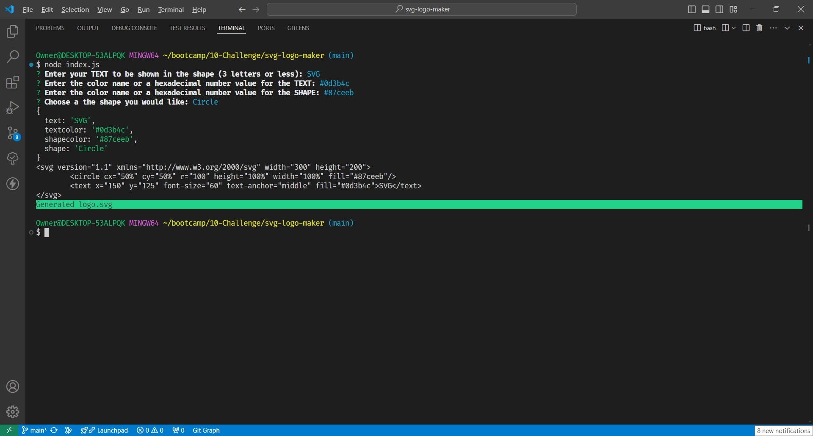
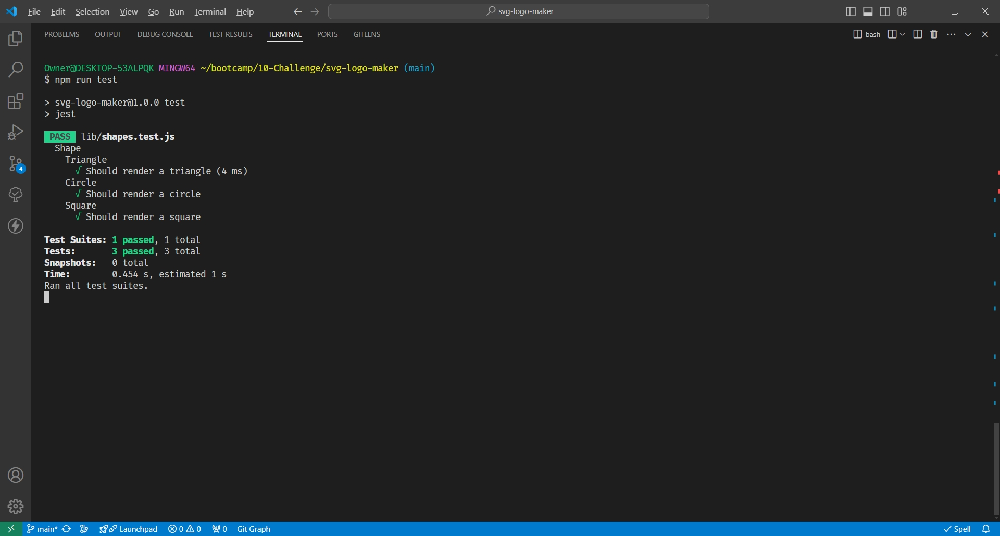
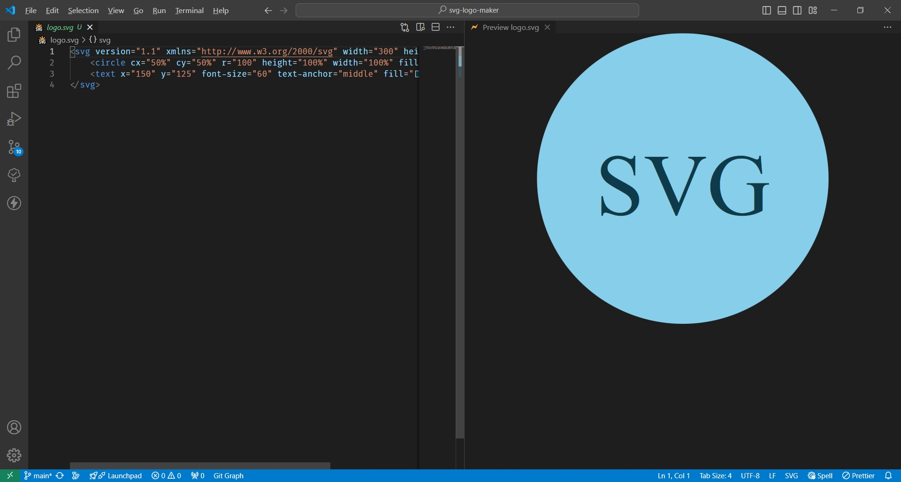

# Svg Logo Maker

## Description

This is an application for generating a logo in the format of a SVG. It uses prompts with questions for a user. This utilizes the packages "Inquirer" for posing questions and collection of user data, "File System (FS)" to write the file to the system, "Colors" to display the file created message, and "Jest" for testing the application. In addition, uses those packages with the Node language manager to generate the SVG file using the collected user data.

This application has a testing suite which can be invoked via the terminal. The test will check if the three shape classes a user can choose with defined parameters for each shape respectively.

Each shape class has its own file to keep the structure more organized. This allows for more shapes to be implemented in further updates more easily by adding to each related file such as an "oval" into `circle.js` file or a "rectangle" into the `square.js` file.
  
## Installation

First to use this application head to the [SVG Logo Maker](https://github.com/EXCervantes/svg-logo-maker) and clone the repository. To learn how to clone a repository checkout this guide [Cloning a repository](https://docs.github.com/en/repositories/creating-and-managing-repositories/cloning-a-repository).

You must have `node` installed on your system. Go [here](https://nodejs.org/en/learn/getting-started/how-to-install-nodejs) for instructions on how to do so.

Then in the Terminal run `npm install` to install the `inquirer@8.2.4`, `colors`, and `jest` packages. For help on these click [here](https://www.npmjs.com/package/inquirer/v/8.2.4) for `inquirer` or [here](https://www.npmjs.com/package/colors) for `colors` or [here](https://www.npmjs.com/package/jest) for `jest`. Finally to initialize this application run `node index.js` in the Terminal.
  
## Usage
  
To run the application open the Terminal or GitBash in VSCode and run `node index.js`. The application will ask a series of questions about the project using the `inquirer` package.

Once the data is entered, the application will generate a SVG file using the code from the files respective to the user's chosen shape along with the parent class code file. It will write the file via `fs.writeFile` titled `logo.svg`. The `logo.svg` file will have the chosen shape, text, text color, and shape color. 

To test the application using `jest` type `npm run test` to run it. The application should pass each test for Triangle, Circle, and Square.

These are examples of logos created with this application.

### Video Demonstrating Application In Use

Here is a [link](https://drive.google.com/file/d/1ilPEruKmzC0mjkMcWL2lcw457T4rn2yt/view?usp=drive_link) to a video demonstrating how this application works.

### Screenshots of the Application

## Credits

Referenced for class constructors

"_node.js - How to set default value for an answer using inquirer? - Stack Overflow_. (2022, January 24). Stack Overflow. Retrieved June 6, 2024, from https://stackoverflow.com/questions/70827997/modify-the-constructor-function-of-a-class
  
## License

This project is licensed under 

Please see the [License](https://opensource.org/licenses/MIT) page for more info.
